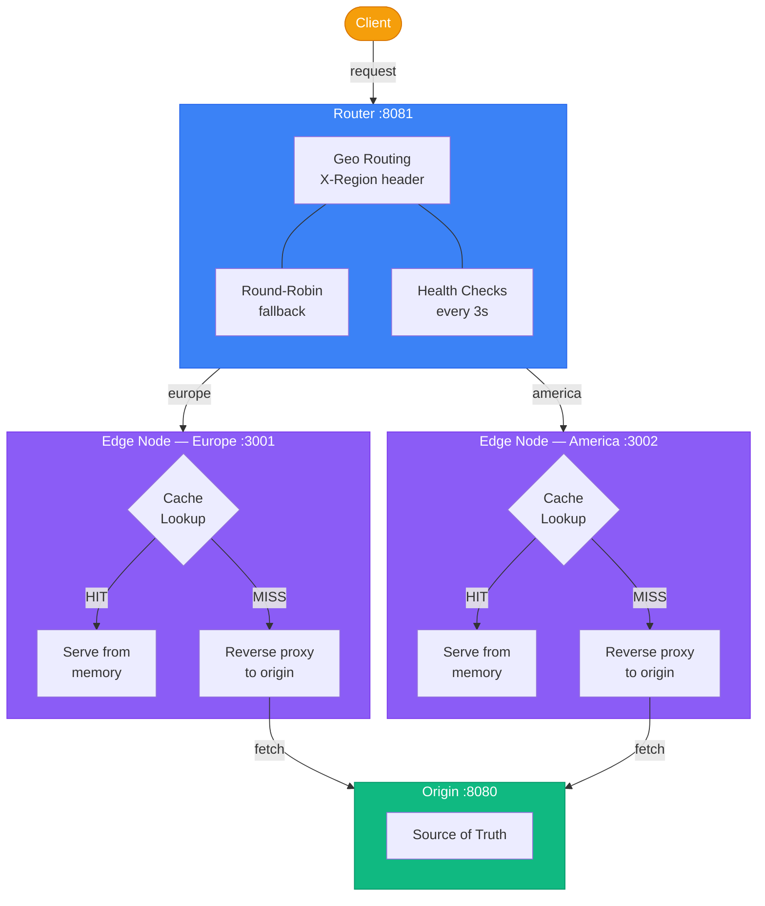
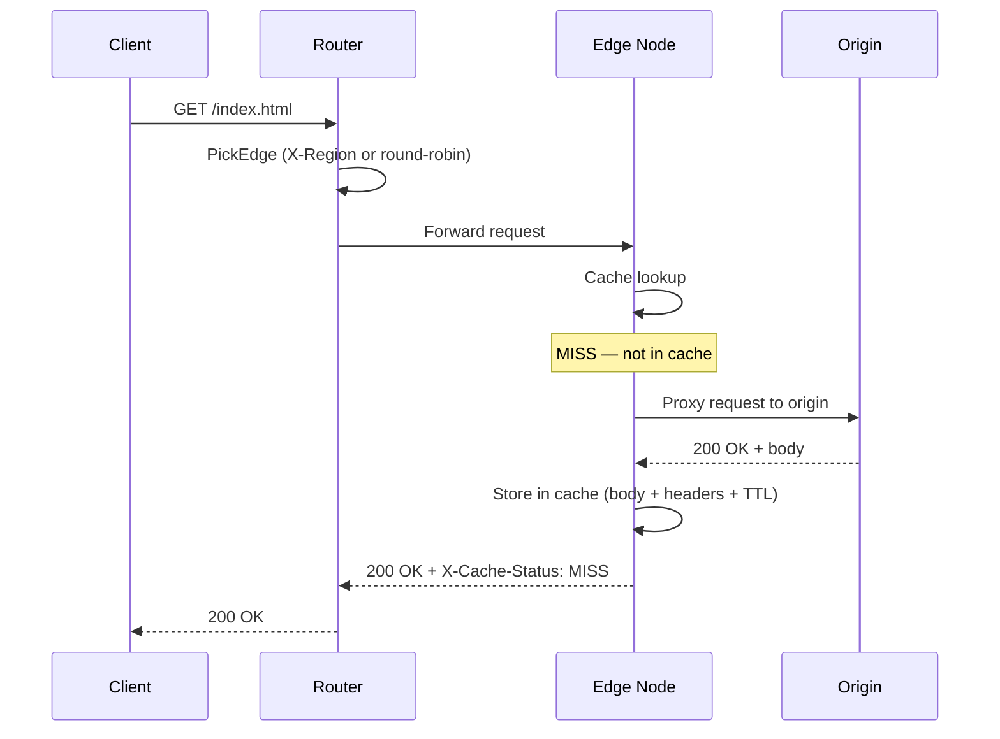
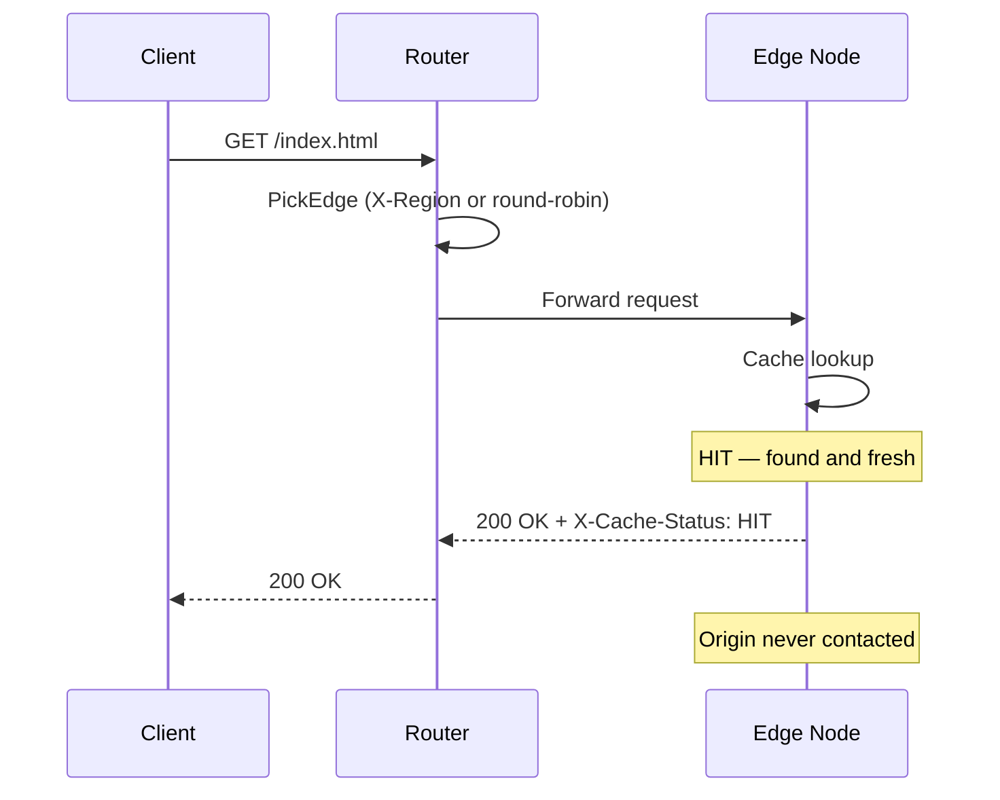
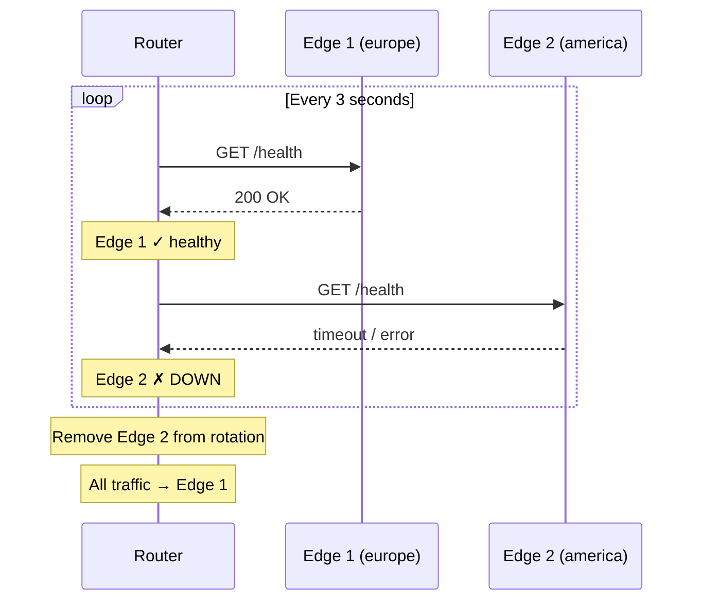

# cdn

A Content Delivery Network built from scratch in Go as a learning project. Single binary, multiple roles — origin server, caching edge nodes, and a geo-aware request router — all orchestrated with Docker Compose.

## Architecture



## How It Works

**One binary, three roles.** The `--type` flag determines what the process does:

- **`origin`** — serves content. The single source of truth.
- **`node`** — caching reverse proxy. Checks its local in-memory cache first; on a miss, forwards the request to the origin, caches the response, and serves it. Subsequent requests for the same path are served directly from cache until the TTL expires.
- **`router`** — entry point for all client traffic. Routes requests to edge nodes based on the `X-Region` header for geographic targeting, with round-robin fallback. Runs background health checks and automatically removes unhealthy nodes from rotation.

## Request Flow

### Cache Miss

The first time content is requested, the edge doesn't have it cached. It proxies to the origin, stores the response, and serves it.



### Cache Hit

Subsequent requests for the same path are served directly from the edge's memory. The origin is never contacted.



### Health Checks

The router pings each edge every 3 seconds. Unhealthy nodes are removed from rotation automatically.



## Quick Start

```bash
docker compose up -d --build
```

This starts 4 containers: 1 origin, 2 edge nodes, and 1 router.

## Endpoints

| URL | Description |
|---|---|
| `http://localhost:8081` | CDN entry point (router) |
| `http://localhost:8080` | Origin directly (bypass CDN) |
| `http://localhost:3001` | Edge node "europe" directly |
| `http://localhost:3002` | Edge node "america" directly |

## Usage

### Cache behavior

```bash
# First request — cache MISS, proxied to origin
curl -v http://localhost:8081/

# Second request — cache HIT, served from edge
curl -v http://localhost:8081/
```

Check the `X-Cache-Status` response header: `MISS` or `HIT`.

### Geographic routing

```bash
# Route to europe edge
curl -H "X-Region: europe" http://localhost:8081/

# Route to america edge
curl -H "X-Region: america" http://localhost:8081/

# No header — round-robin across all healthy edges
curl http://localhost:8081/
```

### Health checks

```bash
# Stop an edge — router will detect it and route around
docker compose stop node2

# All traffic now goes to node1
curl -H "X-Region: america" http://localhost:8081/

# Bring it back — router picks it up automatically
docker compose start node2
```

## Running Locally (without Docker)

```bash
go build -o cdn .

# Terminal 1
./cdn --type=origin

# Terminal 2
ORIGIN_URL=http://localhost:8080 ./cdn --type=node --location=europe --port=3001

# Terminal 3
ORIGIN_URL=http://localhost:8080 ./cdn --type=node --location=america --port=3002

# Terminal 4
EDGE_MAP=europe=http://localhost:3001,america=http://localhost:3002 ./cdn --type=router
```

## Running Tests

```bash
go test -v .
```

## Project Structure

```
├── main.go              # Entry point, role switching (origin/node/router)
├── cache.go             # In-memory cache with TTL expiry and RWMutex
├── cache_test.go        # Cache unit tests
├── router.go            # Router with geo routing, round-robin, health checks
├── Dockerfile           # Multi-stage build (golang → alpine)
├── docker-compose.yml   # 4-service orchestration
└── go.mod
```

## Configuration

| Variable | Used by | Description |
|---|---|---|
| `--type` | all | Role: `origin`, `node`, or `router` |
| `--port` | node | Port to listen on |
| `--location` | node | Region label (for logging) |
| `ORIGIN_URL` | node | URL of the origin server |
| `EDGE_MAP` | router | Region-to-edge mapping (e.g. `europe=http://node1:3001,america=http://node2:3002`) |

## Key Concepts Covered

- **Reverse proxying** with `net/http/httputil.ReverseProxy`
- **In-memory caching** with `sync.RWMutex` for concurrent access
- **TTL-based cache expiry**
- **Response interception** via `ModifyResponse` to capture and cache upstream responses
- **Geographic request routing** with header-based edge selection
- **Round-robin load balancing** with `sync/atomic` for thread-safe index rotation
- **Health checking** with background goroutines and `time.Ticker`
- **Multi-stage Docker builds** for minimal container images
- **Single-binary multi-role architecture**

## Built With

- Go 1.24 (stdlib only, no external dependencies)
- Docker & Docker Compose
